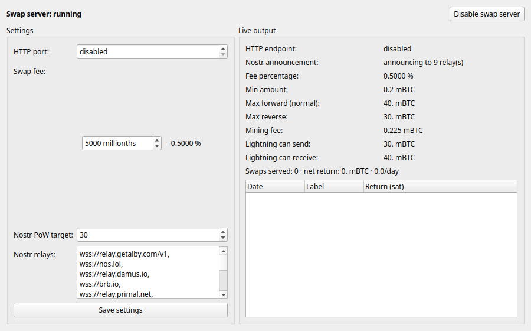

# swapserver_gui — Electrum "Swap Server" tab

A Qt GUI plugin for [Electrum](https://github.com/spesmilo/electrum) that adds a
**Swap Server** tab for managing Electrum's built-in submarine swap server
([docs](https://electrum.readthedocs.io/en/latest/swapserver.html)).



From the tab you can:

- **Enable / disable** the swap server at runtime.
- **Edit every server setting**: HTTP port, swap fee, nostr relays, and the
  nostr announcement proof-of-work target.
- **Watch live output**: the advertised pairs (min / max-forward / max-reverse /
  mining fee / fee %), your lightning send/receive liquidity, and the history &
  running P/L of swaps this node has served.

The server runs two independent transports (either or both):

- **HTTP** — an aiohttp endpoint on `localhost:<port>` (`/getpairs`,
  `/createswap`, …), reusing Electrum's bundled `swapserver` request handlers.
- **Nostr** — announces the offer to the configured `nostr_relays`.

## Why a separate plugin?

Electrum ships a `swapserver` plugin, but it is `available_for: ["cmdline"]`
only — it never loads (and never registers its settings) in the Qt GUI. This
plugin is `available_for: ["qt"]`. It **reuses** the upstream request handlers
and config vars (`plugins.swapserver.port`, `.fee_millionths`, `.ann_pow_nonce`)
rather than redeclaring them, and adds its own `plugins.swapserver_gui.autostart`
flag so the server can be restored on the next wallet open.

Because Electrum starts the swap manager with `is_server = False`, the server
tasks are never spawned by Electrum itself in the GUI; the plugin starts/stops
them on the network asyncio loop and keeps the aiohttp `AppRunner` so the HTTP
listener can be shut down cleanly (`swapserver_gui.py:ManagedHttpSwapServer`).

## Layout

```
plugins/swapserver_gui/
  manifest.json        # available_for: ["qt"], min_electrum_version
  __init__.py          # registers plugins.swapserver_gui.autostart
  swapserver_gui.py    # GUI-agnostic server lifecycle + history helpers
  qt.py                # the "Swap Server" tab + Plugin(load_wallet/close_wallet)
tests/                 # unit + HTTP end-to-end tests (no GUI needed)
contrib/make_zip.sh    # build the external-plugin zip
contrib/regtest_demo/  # one-command local regtest + nostr demo
```

## Installing

**As an external zip (for users):**

```bash
bash contrib/make_zip.sh          # -> dist/swapserver_gui.zip
```

Then in Electrum: *Tools → Plugins → Add* the zip and authorise it. The zip is a
plain archive — **no signing key or build secret is required**. Electrum's
authorisation is a local, user-controlled anti-malware step: the first time you
install any third-party plugin, Electrum asks you to pick a "plugin
authorization password", stores the derived pubkey in a root-owned file (one
`pkexec`/sudo prompt), and signs the zip locally with it. Note external plugins
require running Electrum **from source**.

**For development:** symlink the package into an Electrum source checkout's
internal plugins directory (internal plugins are auto-authorised):

```bash
ln -s "$PWD/plugins/swapserver_gui" /path/to/electrum/electrum/plugins/swapserver_gui
```

## Testing

```bash
# ELECTRUM_SRC defaults to ../electrum
ELECTRUM_SRC=/path/to/electrum python3 -m unittest discover -s tests -v
```

- `tests/test_swapserver_gui.py` — start/stop state machine, config gating, and
  history aggregation (mocked swap manager, real asyncio loop).
- `tests/test_http_endpoint.py` — starts the real `ManagedHttpSwapServer`, does a
  live `GET /getpairs`, validates the JSON, and asserts the port is released on
  stop.

For a **full GUI e2e** — a real Electrum Qt GUI (offscreen) with the plugin
loaded, auto-starting the server and serving a real `/getpairs` — see
`contrib/regtest_demo/run_demo.sh e2e`.

CI (`.github/workflows/build-plugin.yml`) runs the tests and publishes
`swapserver_gui.zip` as an artifact (and a release asset on `v*` tags).

## Manual review (regtest + local nostr relay)

```bash
bash contrib/regtest_demo/run_demo.sh          # brings up the stack + GUI
bash contrib/regtest_demo/run_demo.sh stop     # tear down services
```

See [contrib/regtest_demo/README.md](contrib/regtest_demo/README.md).

## License

The Unlicense (public domain). See `LICENSE`.
