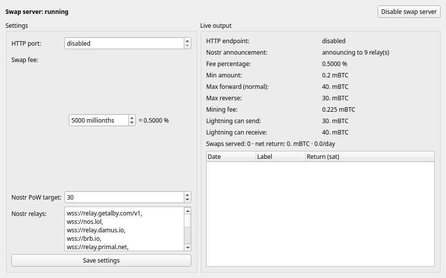

# swapserver_gui — Electrum "Swap Server" tab

A Qt GUI plugin for [Electrum](https://github.com/spesmilo/electrum) that adds a
**Swap Server** tab for managing Electrum's built-in submarine swap server
([docs](https://electrum.readthedocs.io/en/latest/swapserver.html)).



From the tab you can:

- **Enable / disable** the swap server at runtime.
- **Edit every server setting**: HTTP port, swap fee, nostr relays, and the
  nostr announcement proof-of-work target.
- **Watch live output**, split into two sub-tabs:
  - **Status** — your nostr pubkey (npub, with the identicon takers see), the
    advertised pairs (min / max-forward / max-reverse / mining fee / fee %),
    your lightning send/receive liquidity, and the history & running P/L of
    swaps this node has served.
  - **Diagnostics** — why the offer is or is not going out, the three values a
    taker's filter must match, and a one-click **discoverability check**. See
    [Why can nobody see my swap server?](#why-can-nobody-see-my-swap-server)

The server runs two independent transports (either or both):

- **HTTP** — an aiohttp endpoint on `localhost:<port>` (`/getpairs`,
  `/createswap`, …), reusing Electrum's bundled `swapserver` request handlers.
- **Nostr** — announces the offer to the configured `nostr_relays`.

## Why a separate plugin?

Electrum ships a `swapserver` plugin, but it is `available_for: ["cmdline"]`
only — it never loads (and never registers its settings) in the Qt GUI. This
plugin is `available_for: ["qt"]`. It **reuses** the upstream request handlers
and config vars (`plugins.swapserver.port`, `.fee_millionths`, `.ann_pow_nonce`)
rather than redeclaring them, and adds its own `plugins.swapserver_gui.autostart`
flag so the server can be restored on the next wallet open.

Because Electrum starts the swap manager with `is_server = False`, the server
tasks are never spawned by Electrum itself in the GUI; the plugin starts/stops
them on the network asyncio loop and keeps the aiohttp `AppRunner` so the HTTP
listener can be shut down cleanly (`swapserver_gui.py:ManagedHttpSwapServer`).

## Why can nobody see my swap server?

A swap server can be running, connected, and grinding a perfectly valid proof of
work and still be **completely invisible**, because every rejection on the taker
side is silent — `NostrTransport._get_pairs_loop` in
`electrum/submarine_swaps.py` drops a candidate offer with at most a `debug` log
line. The **Diagnostics** sub-tab exists to make that legible.

A taker only considers an offer when *all* of these line up:

| What | Server side | Taker side |
| --- | --- | --- |
| event kind | `USER_STATUS_NIP38` = `30315` | same |
| `d` tag | `electrum-swapserver-<NOSTR_EVENT_VERSION>` | same — **differs between Electrum versions** |
| `r` tag | `net:<constants.net.NET_NAME>` | same — note `signet` ≠ `mutinynet` |
| `created_at` | now | within ±1 h of the taker's clock |
| proof of work | ground to *your* `SWAPSERVER_POW_TARGET` | at least the *taker's* `SWAPSERVER_POW_TARGET` (**default 30**) |

Ranked causes, most common first:

1. **Nothing was ever published — no liquidity.** `publish_offer` returns early
   unless `max_forward` or `max_reverse` reaches `MIN_SWAP_AMOUNT_SAT`
   (20,000 sat). `max_forward` is capped by *both* your lightning inbound
   capacity and your on-chain spendable balance; `max_reverse` by lightning
   outbound. `server_update_pairs` also rounds both *down* to two leading
   digits, so 19,999 sat becomes 19,000. The Status tab no longer claims to be
   "announcing" in this state.
2. **Proof-of-work asymmetry.** `SWAPSERVER_POW_TARGET` means "bits to grind"
   on the server but "bits I demand" on the taker. Lower it to save CPU and
   every taker still on the default of 30 drops you. The Diagnostics tab warns
   whenever the announcement carries fewer than 30 bits.
3. **Network mismatch.** `signet` and `mutinynet` are separate `NET_NAME`s
   upstream; the `r` tag never matches across them.
4. **Electrum version skew** between the two wallets, via the `d` tag.
5. **The taker is not using nostr at all** — a non-empty `SWAPSERVER_URL` makes
   it build an `HttpTransport`, and a wallet that is itself a server never runs
   the discovery loop.
6. **Relay-side expiry.** Announcements carry a NIP-40 `expiration` of ~10
   minutes and are republished every 10 minutes, so a server that has been down
   for longer has no stored offer left. Some public relays also silently refuse
   kind `30315`.

**Check discoverability** asks each configured relay the taker's own question,
using a throwaway key, and names the first rule that rejects you — per relay,
so "found on 2 of 9" is visible. It runs two queries: one by author (does our
announcement exist here at all?) and one with the taker's verbatim filter (does
it survive it?). That split is what distinguishes a wrong tag from a missing
event from being crowded out of a busy relay's 10-result page.

## Layout

```
plugins/swapserver_gui/
  manifest.json        # available_for: ["qt"], min_electrum_version
  __init__.py          # registers plugins.swapserver_gui.autostart
  _version.py          # plugin version, stamped from the git tag at build time
  swapserver_gui.py    # GUI-agnostic server lifecycle + history helpers
  pow.py               # cancel-safe, resumable announcement proof-of-work
  nostr_check.py       # nostr identity + the discoverability rule engine/check
  qt.py                # the "Swap Server" tab + Plugin(load_wallet/close_wallet)
tests/                 # unit + HTTP/nostr/Qt end-to-end tests
contrib/make_zip.sh    # build the external-plugin zip
contrib/regtest_demo/  # one-command local regtest + nostr demo
```

## Versioning

The tab header shows the installed plugin version, so users can tell which build
they are on. **The git tag is the single source of truth.** `_version.py` is
committed with the placeholder `dev`; `contrib/make_zip.sh` stamps the real value
into a staging copy while building the archive, so the working tree is never
modified:

```bash
bash contrib/make_zip.sh dist 0.2.1   # -> tab shows "v0.2.1"
bash contrib/make_zip.sh dist         # -> tab shows "dev"
```

CI passes `${GITHUB_REF_NAME#v}` for `refs/tags/v*` builds and `dev-g<sha7>`
otherwise, then verifies the stamp landed in the zip. A release asset therefore
can never disagree with the tag it was built from, and any zip from a branch or
PR build is traceable to its commit. To cut a release, push a `vX.Y.Z` tag —
nothing in the tree needs bumping.

## Installing

**As an external zip (for users):**

```bash
bash contrib/make_zip.sh          # -> dist/swapserver_gui.zip
```

Then in Electrum: *Tools → Plugins → Add* the zip and authorise it. The zip is a
plain archive — **no signing key or build secret is required**. Electrum's
authorisation is a local, user-controlled anti-malware step: the first time you
install any third-party plugin, Electrum asks you to pick a "plugin
authorization password", stores the derived pubkey in a root-owned file (one
`pkexec`/sudo prompt), and signs the zip locally with it. Note external plugins
require running Electrum **from source**.

**For development:** symlink the package into an Electrum source checkout's
internal plugins directory (internal plugins are auto-authorised):

```bash
ln -s "$PWD/plugins/swapserver_gui" /path/to/electrum/electrum/plugins/swapserver_gui
```

## Testing

```bash
# ELECTRUM_SRC defaults to ../electrum
ELECTRUM_SRC=/path/to/electrum python3 -m unittest discover -s tests -v
```

- `tests/test_swapserver_gui.py` — start/stop state machine, config gating, and
  history aggregation (mocked swap manager, real asyncio loop).
- `tests/test_http_endpoint.py` — starts the real `ManagedHttpSwapServer`, does a
  live `GET /getpairs`, validates the JSON, and asserts the port is released on
  stop.
- `tests/test_settings_save.py` — persisting settings against a **real**
  `SimpleConfig`, including disabling the HTTP port (see the note below).
- `tests/test_version.py` / `tests/test_zip_plugin_load.py` — version formatting
  and the end-to-end build-time stamping chain.
- `tests/test_nostr_check.py` — the discoverability rule engine, pinned to the
  order of checks `_get_pairs_loop` performs, so the field we blame is the one
  that actually rejects us upstream.
- `tests/test_diagnostics.py` — the announcement state machine, the liquidity
  gate (`publish_offer`'s early return), and the npub shown in the Status tab.
- `tests/test_discovery_e2e.py` — the check driven against a **real** NIP-01
  relay hosted in-process (`tests/fake_relay.py`, aiohttp WebSocket): offers are
  published with `electrum_aionostr` exactly as the server does, signatures are
  verified on receipt, and each failure mode (low PoW, wrong net, wrong version,
  crowded out, unreachable) is asserted to be named correctly.
- `tests/test_qt_tab.py` — builds the real `SwapServerTab` on Qt's offscreen
  platform and drives `refresh()`. **Skips when PyQt6 is not installed**; CI
  installs it so these run there.

### A note on the HTTP port

A disabled HTTP port is stored as `0`, never `None`. `SWAPSERVER_PORT` is the
dotted key `plugins.swapserver.port`, and assigning `None` to it routes into
`SimpleConfig`'s key-*deletion* branch, whose recursion dereferences the
intermediate `plugins.swapserver` dict without checking that it exists — which it
usually does not, since this plugin only writes `plugins.swapserver_gui.*`. The
result was `AttributeError: 'NoneType' object has no attribute 'pop'` on every
"Save settings" with the port disabled. Every reader tests the key for
truthiness, so `0` is equivalent and takes the safe write path. This is an
upstream Electrum bug; the workaround lives here because users run released
AppImages. All writes go through `swapserver_gui.save_settings`, and a static
guard in the tests keeps direct assignments from creeping back into `qt.py`.

For a **full GUI e2e** — a real Electrum Qt GUI (offscreen) with the plugin
loaded, auto-starting the server and serving a real `/getpairs` — see
`contrib/regtest_demo/run_demo.sh e2e`.

CI (`.github/workflows/build-plugin.yml`) runs the tests and publishes
`swapserver_gui.zip` as an artifact (and a release asset on `v*` tags).

## Manual review (regtest + local nostr relay)

```bash
bash contrib/regtest_demo/run_demo.sh          # brings up the stack + GUI
bash contrib/regtest_demo/run_demo.sh stop     # tear down services
```

See [contrib/regtest_demo/README.md](contrib/regtest_demo/README.md).

## License

The Unlicense (public domain). See `LICENSE`.
